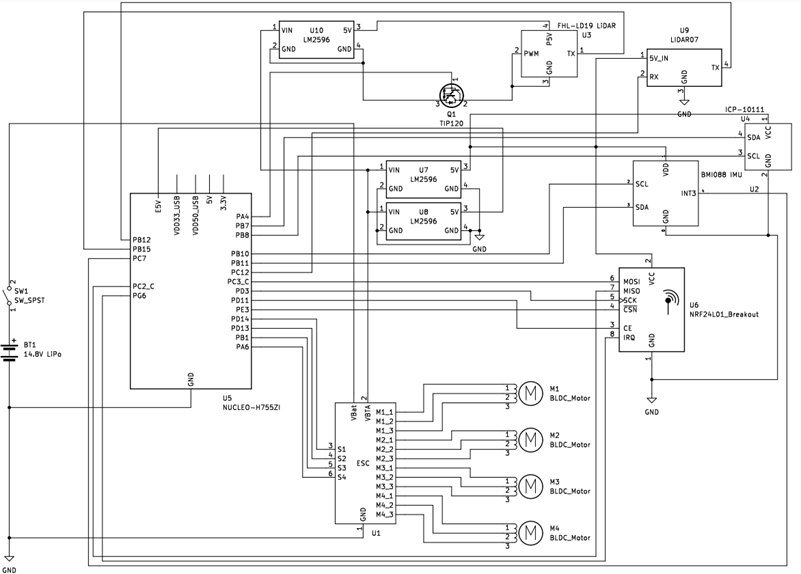
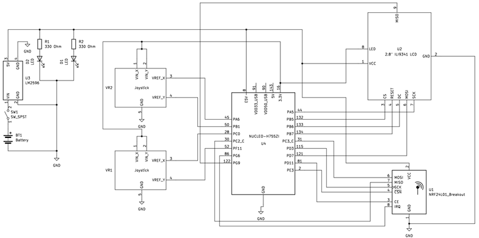
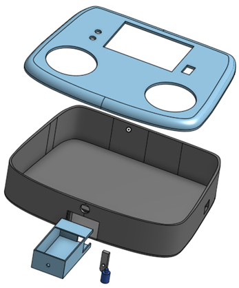
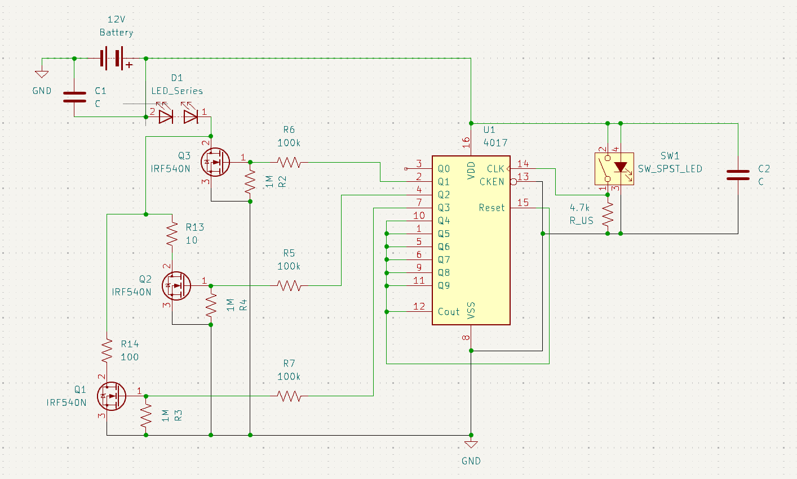
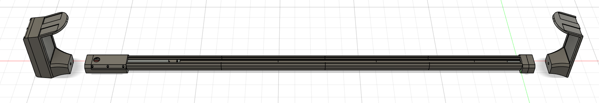
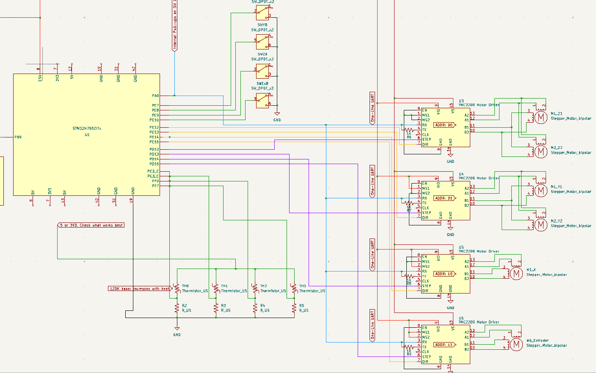
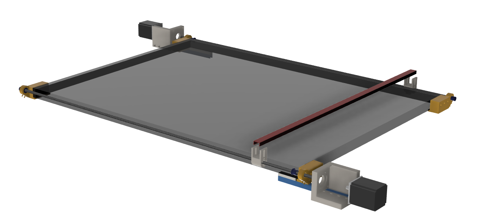
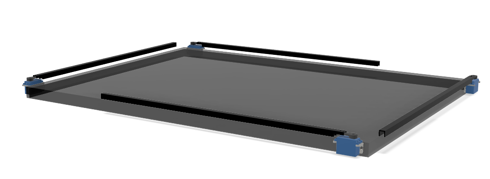
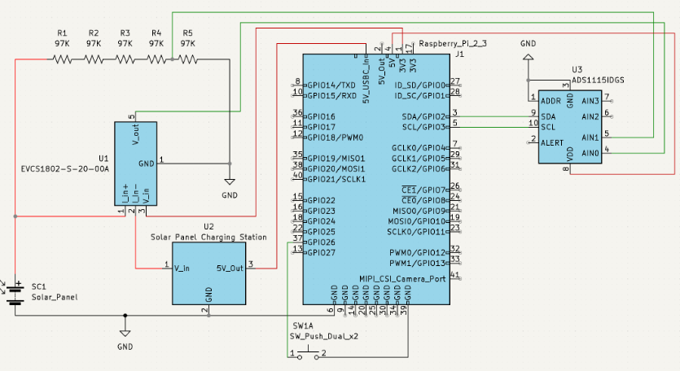

Sample CAD models and circuits from my undergraduate senior project
Quadcopter Circuit and CAD Model:

Controller Circuit and CAD Model:

Sample CAD models and circuits from some of my personal projects
Hood Light Circuit and CAD Model:

CNC Partial Circuit:

Sample CAD models and circuits from my job as a research assitant. These have already been published in:
1. https://ieeexplore.ieee.org/document/11327996
2. https://arxiv.org/abs/2511.04837

